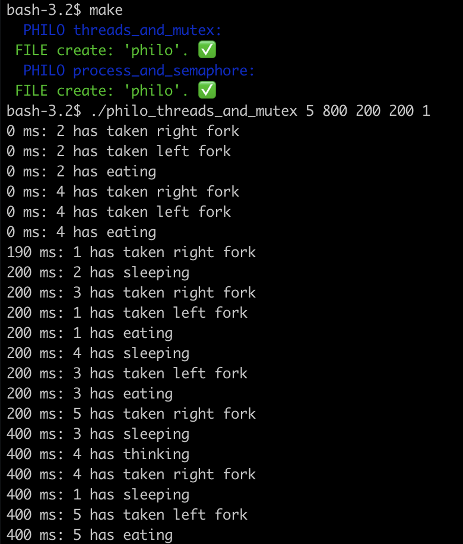

# Philosophers
It's two solves <a href="https://en.wikipedia.org/wiki/Dining_philosophers_problem">dining philosophers problem</a>.
First use threads and mutex. Second use process and semaphore.

For start use ``make``.

For run choose ``philo_process_and_semaphore`` or ``philo_threads_and_mutex`` and put in:
1) Count philosophers.
2) Time to die(in milliseconds).
3) Time to eat(in milliseconds).
4) Time to sleep(in milliseconds).
5) Number of times each philosopher must eat(optional argument).

Example:

  

